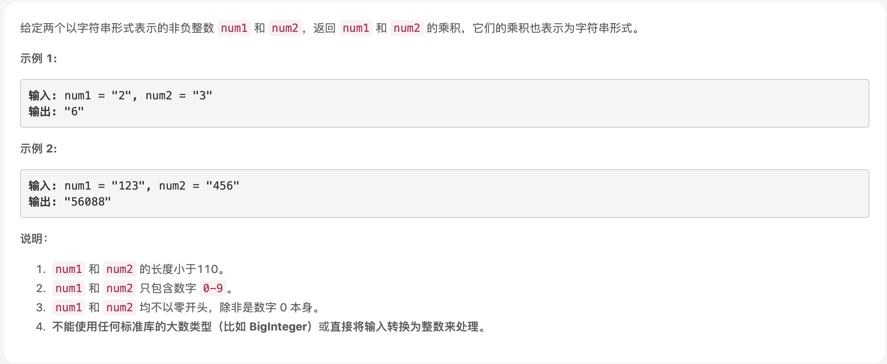

# [字符串相乘](https://leetcode-cn.com/explore/featured/card/bytedance/242/string/1015/)



## 思路

没思路，直接上答案

```js
const multiply = (num1, num2) => {
  const len1 = num1.length
  const len2 = num2.length
  const pos = new Array(len1 + len2).fill(0)

  for (let i = len1 - 1; i >= 0; i--) {
    const n1 = +num1[i]
    for (let j = len2 - 1; j >= 0; j--) {
      const n2 = +num2[j]
      const multi = n1 * n2
      const sum = pos[i + j + 1] + multi

      pos[i + j + 1] = sum % 10
      pos[i + j] += (sum / 10) | 0
    }
  }
  while (pos[0] == 0) {
    pos.shift()
  }
  return pos.length ? pos.join('') : '0'
}
```

这么写也可以

```js
const multiply = (num1, num2) => {
  const len1 = num1.length
  const len2 = num2.length
  const pos = new Array(len1 + len2).fill(0)

  for (let i = len1 - 1; i >= 0; i--) {
    const n1 = +num1[i]
    for (let j = len2 - 1; j >= 0; j--) {
      const n2 = +num2[j]
      const multi = n1 * n2
      const sum = pos[i + j + 1] + multi

      pos[i + j + 1] = sum % 10
      pos[i + j] += (sum / 10) | 0
    }
  }
  let resStr = pos.join('')
  while (resStr[0] == '0') {
    resStr = resStr.substring(1)
  }
  return resStr.length ? resStr : '0'
}
```
