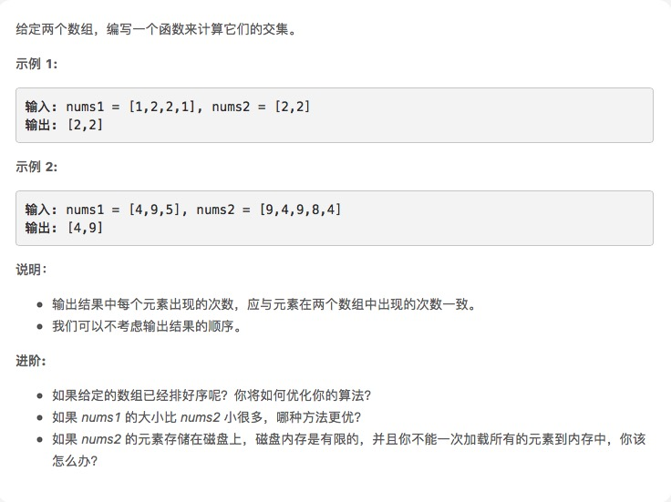

# [两个数组的交集](https://leetcode-cn.com/explore/interview/card/top-interview-questions-easy/1/array/26/)



## 思路

便利数组1，如果数组2里面有，则push进结果数组，关键就是判断之后要nums2.splice,把遍历过了，且同时存在于两个数组中的元素给去掉


## 自己开始写的

```js
var intersect = function(nums1, nums2) {
    var arr = [];
    for(var i=0,len=nums1.length;i<len;i++){
        var item =nums1[i]
        if(nums2.indexOf(item)>=0){
            arr.push(item);
            nums2.splice(nums2.indexOf(item),1)
        }
    }
    return arr;
};
```
这个原理差不多，只不过使用了es6的filter,includes等方法

```js
/**
 * @param {number[]} nums1
 * @param {number[]} nums2
 * @return {number[]}
 */
var intersect = function(nums1, nums2) {
 return nums1.filter((el) => {
     return nums2.includes(el) && nums2.splice(nums2.indexOf(el), 1)
     })
};
```