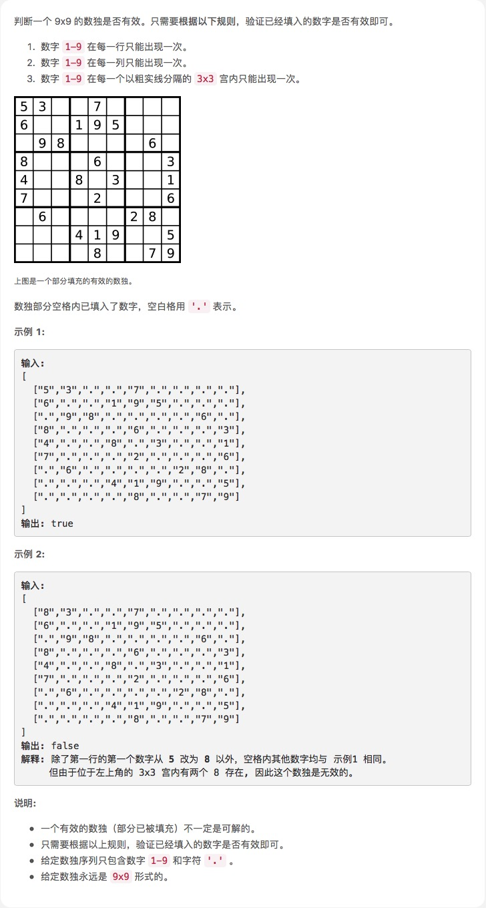

# [有效数独](https://leetcode-cn.com/explore/interview/card/top-interview-questions-easy/1/array/30/)



司徒大大的解，很优雅，关键就是index = 3 * Math.trunc(i / 3) + Math.trunc(j / 3),计算每个小cube的index
```js
function isValidSudoku(board) {
    var rows = []//行
    var cols = [] // 列
    var cubes = []//9宫格
    for (var i = 0; i < 9; i++) {
        rows.push({})
        cols.push({})
        cubes.push({})
    }
    for (var i = 0; i < 9; i++) { //循环行
        for (var j = 0; j < 9; j++) {//循环列
            var cur = board[i][j]
            if (cur != '.') {
                var index = 3 * Math.trunc(i / 3) + Math.trunc(j / 3)
                if (rows[i][cur] || cols[j][cur] || cubes[index][cur]) return false;
                rows[i][cur] = true
                cols[j][cur] = true
                cubes[index][cur] = true
            }
        }
    }
    return true;
}

```
我开始写的
```js
/**
 * @param {character[][]} board
 * @return {boolean}
 */
var isValidSudoku = function (board) {
    //检验长度和字符是否正确
    if (board.length != 9) return false;
    try {
        board.forEach(element => {
            if (element.length != 9) {
                throw new error;
            }
            element.forEach(item => {
                var reg = /[^1-9]/
                if (reg.test(item) && item !== '.') {
                    throw new error;
                }
            });
            if (containsDuplicate(element)) { //检查每一行是否重复
                throw new error;
            }
        });
    } catch (error) {
        return false;
    }

    //检查每一列是否重复
    // var colums = []
    for (var i = 0; i < 9; i++) {
        var colum = []
        for (var j = 0; j < 9; j++) {
            colum.push(board[j][i]);
        }
        if (containsDuplicate(colum)) {
            return false;
        }
        // colums.push(colum)
    }
    //检查每个小九宫格
    var limit = 0; //游标
    while (limit < 9) {
        var litNine = [];
        for (var i = limit; i < limit + 3; i++) {  //列
            for (var j = 0; j < 3; j++) {      //行
                litNine.push(board[j][i]);
            }
        }
        if (containsDuplicate(litNine)) {
            return false;
        }
        limit = limit + 3;
    }
    limit = 0; //游标
    while (limit < 9) {
        var litNine = [];
        for (var i = limit; i < limit + 3; i++) {  //列
            for (var j = 3; j < 6; j++) {      //行
                litNine.push(board[j][i]);
            }
        }
        if (containsDuplicate(litNine)) {
            return false;
        }
        limit = limit + 3;
    }
    limit = 0; //游标
    while (limit < 9) {
        var litNine = [];
        for (var i = limit; i < limit + 3; i++) {  //列
            for (var j = 6; j < 9; j++) {      //行
                litNine.push(board[j][i]);
            }
        }
        if (containsDuplicate(litNine)) {
            return false;
        }
        limit = limit + 3;
    }

    //存在重复检查方法
    function containsDuplicate(nums) {
        nums = nums.filter(item => item != '.') //先去掉点
        if (nums.length <= 1) {
            return false;
        }
        nums = nums.sort();
        for (let i = 0; i < nums.length; i++) {
            if ((i + 1) < nums.length && nums[i] === nums[i + 1]) {
                return true;
            }
        }
        return false;
    };

    return true;

};
```