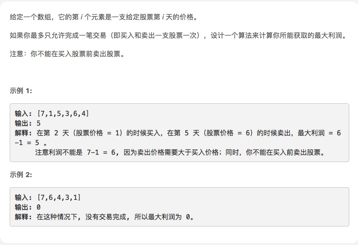

# [买卖股票的最佳时机](https://leetcode-cn.com/explore/interview/card/top-interview-questions-easy/23/dynamic-programming/55/)



## 思路

我开始还以为和数组那个[买股票最佳时期](https://leetcode-cn.com/problems/best-time-to-buy-and-sell-stock-ii/)题目一样。注意区别，只允许交易一次￣□￣｜｜

### 1. 暴力枚举

```js
/**
 * @param {number[]} prices
 * @return {number}
 */
var maxProfit = function(prices) {
  var maxprofit = 0
  for(var i=0;i<prices.length;i++){
   for(var j=i+1;j<prices.length;j++){
        var profit = prices[j] - prices[i];
        if (profit > maxprofit) maxprofit = profit;
   }   
  }
  return maxprofit
};
```
### 2. 暴力枚举的优化

我们发现：其实只需要关心之前（不包括现在）看到的最低股价，于是在遍历的过程中，记录下之前看到的最低股价，就可以省去内层循环。

```js
var  maxProfit = function(prices) {
        var len = prices.length;
        if (len < 2) {
            return 0;
        }
        var res = 0;
        // 表示在当前位置之前的最小值，假设修正法（打擂台法）
        var minVal = prices[0];
        // 注意：这里从 1 开始
        for (var i = 1; i < len; i++) {
            res = Math.max(res, prices[i] - minVal);
            minVal = Math.min(minVal, prices[i]);
        }
        return res;
    }
```

### 3. 动态规划
 
 动态规划的 5 个步骤：

1. 设定状态

  这道题其实是一个典型的二维 dp 问题。“动态规划”用于多阶段最优化问题的求解。这里天数代表每个阶段，即一天一天看，设置为第一维。为了消除后效性（前
  面的状态确定下来以后不会因为后面状态而更改），将当天是否持股设置为第二维的状态。于是：

  状态 dp[i][j] 表示：在索引为 i 的这一天，用户手上持股状态为 j 所获得的最大利润。

  说明：

  j 只有 2 个值：0 表示不持股（特指卖出股票以后的不持股状态），1 表示持股。
  “用户手上不持股”不代表用户一定在索引为 i 的这一天把股票抛售了；
2. 思考状态转移方程
  dp[i][0] 怎样转移？

  dp[i - 1][0] ：当然可以从昨天不持股转移过来，表示从昨天到今天什么都不操作，这一点是显然的；

  dp[i - 1][1] + prices[i]：昨天持股，就在索引为 i 的这一天，我卖出了股票，状态由 1 变成了 0，此时卖出股票，因此加上这一天的股价。

  综上：dp[i][0] = max(dp[i - 1][0], dp[i - 1][1] + prices[i]);

  dp[i][1] 怎样转移？

  dp[i - 1][1] ：昨天持股，今天什么都不操作，当然可以从昨天持股转移过来，这一点是显然的；

  -prices[i]：注意：状态 1 不能由状态 0 来，因为事实上，状态 0 特指：“卖出股票以后不持有股票的状态”，请注意这个状态和“没有进行过任何一次交易的不持有股票的状态”的区别。

  因此，-prices[i] 就表示，在索引为 i 的这一天，执行买入操作得到的收益。注意：因为题目只允许一次交易，因此不能加上 dp[i - 1][0]。

  综上：dp[i][1] = max(dp[i - 1][1], -prices[i]);

3. 考虑初始值
  第 0 天不持股，显然 dp[0][0] = 0；

  第 0 天持股，显然dp[0][1] = -prices[0]。

4. 考虑输出
  从状态转移方程可以看出，每一天的状态都考虑了之前的状态。在只发生一次交易的情况下，持有这支股票一定不能使我们获得最大利润。因此输出是 dp[len - 1][0]，不可能是持股的状态 dp[len - 1][1]，

```js
var maxProfit = function(prices) {
        var len = prices.length;
        if (len < 2) {
            return 0;
        }

        // 0：用户手上不持股所能获得的最大利润，特指卖出股票以后的不持股，非指没有进行过任何交易的不持股
        // 1：用户手上持股所能获得的最大利润

        // 注意：因为题目限制只能交易一次，因此状态只可能从 1 到 0，不可能从 0 到 1
        // int[][] dp = new int[len][2];
        for (var i = 0; i < len; i++) {
          var arr = []
          for (var j = 0; j < 2; j++) {
            arr.push("")
          }
          dp.push(arr)
        }
        dp[0][0] = 0;
        dp[0][1] = -prices[0];
        for (var i = 1; i < len; i++) {
            dp[i][0] = Math.max(dp[i - 1][0], dp[i - 1][1] + prices[i]);
            dp[i][1] = Math.max(dp[i - 1][1], -prices[i]);
        }
        return dp[len - 1][0];
    }
```


参考原文：https://leetcode-cn.com/problems/best-time-to-buy-and-sell-stock/solution/bao-li-mei-ju-dong-tai-gui-hua-chai-fen-si-xiang-b