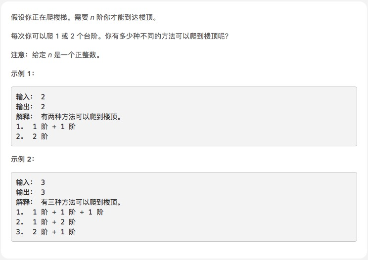

# [爬楼梯](https://leetcode-cn.com/explore/interview/card/top-interview-questions-easy/23/dynamic-programming/54/)



## 思路

用递归的思路想一下，要求 n 层的台阶的走法，由于一次走 1 或 2 个台阶，所以上到第 n 个台阶之前，一定是停留在第 n - 1 个台阶上，或者 n - 2 个台阶上。所以如果用 f ( n ) 代表 n 个台阶的走法。那么，

f ( n ) = f ( n - 1) + f ( n - 2 )。

f ( 1 ) = 1，f ( 2 ) = 2 。

这不就是斐波拉契数列吗

```js
function climbStairs(int n) {
    if (n == 1) {
        return 1;
    }
    if (n == 2) {
        return 2;
    }
    return climbStairs(n - 1) + climbStairs(n - 2);
}

```
那斐波拉契数列可以使用DP写法

```js
var climbStairs = function (n) {
    var results = [];
    for (var i = 0; i < n; i++) {
        if (i < 2) {
            results[i] = i + 1
        } else {
            results[i] = results[i - 1] + results[i - 2]
        }
    }
    return results[n - 1]
};
```