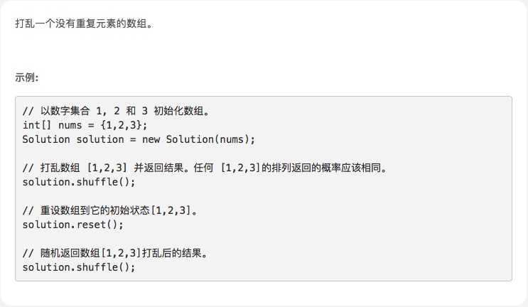

# [打乱数组](https://leetcode-cn.com/explore/interview/card/top-interview-questions-easy/24/design/58/)



## 思路

洗牌算法能保证，对于生成的排列，每一个元素都能等概率的出现在每一个位置。

数组长度为n， 先从n个数据中，随机选取一个元素，与最后一个元素交换

每个元素被选中的概率是 1/n

从剩下长度的 n-1 元素中随便取一个，与倒数第二个元素交换，第一次没有被选中的概率为 n-1/n

第二次被选中的概率为 1/n-1 , 所以概率仍然是 (n-1)/n * 1/(n-1) = 1/n

所以每一个元素出现在每一个位置的概率，都是 1/n

```js
/**
 * @param {number[]} nums
 */
var Solution = function (nums) {
    this.arr = nums;
};

/**
 * Resets the array to its original configuration and return it.
 * @return {number[]}
 */
Solution.prototype.reset = function () {
    return this.arr;
};

/**
 * Returns a random shuffling of the array.
 * @return {number[]}
 */
Solution.prototype.shuffle = function () {
    let nums = [...this.arr];
    let n = nums.length - 1;
    while (n >= 0) {
        let index = parseInt(Math.random() * (n + 1));
        [nums[index], nums[n]] = [nums[n], nums[index]];
        n--;
    }
    return nums;
};

/**
 * Your Solution object will be instantiated and called as such:
 * var obj = new Solution(nums)
 * var param_1 = obj.reset()
 * var param_2 = obj.shuffle()
 */


/**
 * Your Solution object will be instantiated and called as such:
 * var obj = new Solution(nums)
 * var param_1 = obj.reset()
 * var param_2 = obj.shuffle()
 */

```

方法二，顺序打乱

```js
/**
 * @param {number[]} nums
 */
var Solution = function(nums) {
    this.arr = nums;
};

/**
 * Resets the array to its original configuration and return it.
 * @return {number[]}
 */
Solution.prototype.reset = function() {
    return this.arr;
};

/**
 * Returns a random shuffling of the array.
 * @return {number[]}
 */
Solution.prototype.shuffle = function() {
    let nums = [...this.arr];
    let i = 0;
    function getRandom(start, end) {
        return  parseInt(start + Math.random() * (end - start))
    }
    while(i < nums.length - 1) {
        let index = getRandom(i, nums.length);
        [nums[index], nums[i]] = [nums[i], nums[index]];
        i++;
    }
    return nums;
};

/**
 * Your Solution object will be instantiated and called as such:
 * var obj = new Solution(nums)
 * var param_1 = obj.reset()
 * var param_2 = obj.shuffle()
 */
```