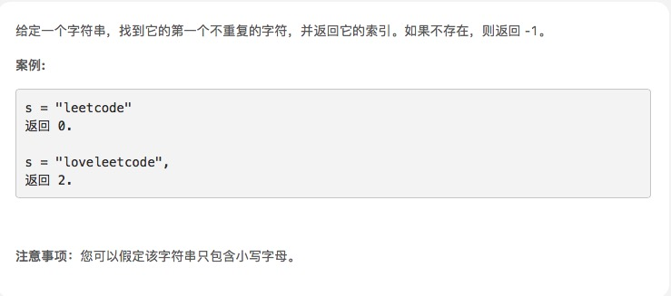

# [字符串中的第一个唯一字符](https://leetcode-cn.com/explore/interview/card/top-interview-questions-easy/5/strings/34/)



题解里的，很巧妙

```js
var firstUniqChar = function(s) {
    for (let i = 0; i < s.length; i++) {
        if (s.indexOf(s[i]) === s.lastIndexOf(s[i])) {
            return i
        }
    }
    return -1
};
```

自己开始写的，感觉很不优雅
```js
var firstUniqChar = function (s) {
    if (s.length == 0) return -1
    if (s.length == 1) return 0
    s = s.split("") //转成数组
    var temp = [], index = 0;
    for (var i = 0; i < s.length; i++) {
        var char = s[i]; //当前原生
        s.splice(i, 1) //删掉该字符后
        i--;

        if (s.indexOf(char) < 0 && temp.indexOf(char) < 0) { //没有了
            return index;
        }
        temp.push(char);
        index++;
    }
    return -1;
};
```

