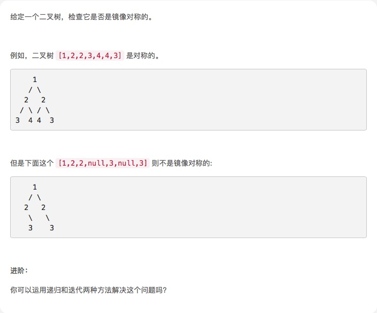

# [对称二叉树](https://leetcode-cn.com/explore/interview/card/top-interview-questions-easy/7/trees/49/)



```js
/**
 * Definition for a binary tree node.
 * function TreeNode(val) {
 *     this.val = val;
 *     this.left = this.right = null;
 * }
 */
/**
 * @param {TreeNode} root
 * @return {boolean}
 */
var isSymmetric = function (root) {
  // write code here
  //空树 认为是对称的
  if (root === null) return true
  //不是空树，则判断左右子树
  return help(root.left, root.right)
}
function help(left, right) {
  //左子树为空，当右子树为空时对称
  if (left === null) {
    return right === null
  }
  //经过上一行判断出左子树不为空了，右子树为空的话不对称
  if (right === null) {
    return false
  }
  //两个节点元素值不一样也不对称
  if (left.val !== right.val) {
    return false
  }
  //判断子树1的右子树和子树2的左子树是否相同，子树1的左子树和子树2的右子树是否相同

  return help(left.left, right.right) && help(left.right, right.left)
}
```

迭代写法：

```js
var isSymmetric = function (root) {
  //队列
  var queue = []
  if (root == null) return true
  //左子节点和右子节点同时入队
  queue.push(root.left)
  queue.push(root.right)
  //如果队列不为空就继续循环
  while (queue.length > 0) {
    //每两个出队
    var left = queue.shift(),
      right = queue.shift()
    //如果都为空继续循环
    if (left == null && right == null) continue
    //如果一个为空一个不为空，说明不是对称的，直接返回false
    if ((left == null) ^ (right == null)) return false
    //如果这两个值不相同，也不是对称的，直接返回false
    if (left.val != right.val) return false
    //这里要记住入队的顺序，他会每两个两个的出队。
    //左子节点的左子节点和右子节点的右子节点同时
    //入队，因为他俩会同时比较。
    //左子节点的右子节点和右子节点的左子节点同时入队，
    //因为他俩会同时比较
    queue.push(left.left)
    queue.push(right.right)
    queue.push(left.right)
    queue.push(right.left)
  }
  return true
}
```
