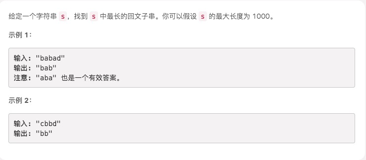

# [最长回文子串](https://leetcode-cn.com/problems/longest-palindromic-substring/)



## 思路

官方题解里有个大佬整理的特别好,所以直接摘录：[https://leetcode-cn.com/problems/longest-palindromic-substring/solution/zhong-xin-kuo-san-dong-tai-gui-hua-by-liweiwei1419/](https://leetcode-cn.com/problems/longest-palindromic-substring/solution/zhong-xin-kuo-san-dong-tai-gui-hua-by-liweiwei1419/)

### 方法一 暴力匹配

* 根据回文子串的定义，枚举所有长度大于等于 2 的子串，依次判断它们是否是回文；
* 在具体实现时，可以只针对大于“当前得到的最长回文子串长度”的子串进行“回文验证”；
* 在记录最长回文子串的时候，可以只记录“当前子串的起始位置”和“子串长度”，不必做截取。这一步我们放在后面的方法中实现。

说明：暴力解法时间复杂度高，但是思路清晰、编写简单。由于编写正确性的可能性很大，可以使用暴力匹配算法检验我们编写的其它算法是否正确。优化的解法在很多时候，是基于“暴力解法”，以空间换时间得到的，因此思考清楚暴力解法，分析其缺点，很多时候能为我们打开思路。


```js
var longestPalindrome = function(s) {
        var len = s.length;
        if (len < 2) {
            return s;
        }

        var maxLen = 1;
        var begin = 0;
       
        var charArray = s.split("");

        // 枚举所有长度大于 1 的子串 charArray[i..j]
        for (var i = 0; i < len - 1; i++) {
            for (var j = i + 1; j < len; j++) {
                if (j - i + 1 > maxLen && validPalindromic(charArray, i, j)) {
                    maxLen = j - i + 1;
                    begin = i;
                }
            }
        }
        return s.substring(begin, begin + maxLen);
    }

    /**
     * 验证子串 s[left..right] 是否为回文串
     */
    var validPalindromic = function(charArray,left,right) {
        while (left < right) {
            if (charArray[left] != charArray[right]) {
                return false;
            }
            left++;
            right--;
        }
        return true;
    }
```  

### 方法二 动态规划


1. 思考状态（重点）

    * 状态的定义，先尝试「题目问什么，就把什么设置为状态」；
    * 然后思考「状态如何转移」，如果「状态转移方程」不容易得到，尝试修改定义，目的依然是为了方便得到「状态转移方程」。
    >状态转移方程」是原始问题的不同规模的子问题的联系。即大问题的最优解如何由小问题的最优解得到。

2. 思考状态转移方程（核心、难点）

    * 状态转移方程是非常重要的，是动态规划的核心，也是难点；

    * 常见的推导技巧是：分类讨论。即：对状态空间进行分类；

    * 归纳「状态转移方程」是一个很灵活的事情，通常是具体问题具体分析；

    * 除了掌握经典的动态规划问题以外，还需要多做题；

    * 如果是针对面试，请自行把握难度。掌握常见问题的动态规划解法，理解动态规划解决问题，是从一个小规模问题出发，逐步得到大问题的解，并记录中间过程；

    * 「动态规划」方法依然是「空间换时间」思想的体现，常见的解决问题的过程很像在「填表」。

3. 思考初始化

    初始化是非常重要的，一步错，步步错。初始化状态一定要设置对，才可能得到正确的结果。

    * 角度 1：直接从状态的语义出发；

    * 角度 2：如果状态的语义不好思考，就考虑「状态转移方程」的边界需要什么样初始化的条件；

    * 角度 3：从「状态转移方程」方程的下标看是否需要多设置一行、一列表示「哨兵」（sentinel），这样可以避免一些特殊情况的讨论。

4. 思考输出

    有些时候是最后一个状态，有些时候可能会综合之前所有计算过的状态。

5. 思考优化空间（也可以叫做表格复用）

    * 「优化空间」会使得代码难于理解，且是的「状态」丢失原来的语义，初学的时候可以不一步到位。先把代码写正确是更重要；
    * 「优化空间」在有一种情况下是很有必要的，那就是状态空间非常庞大的时候（处理海量数据），此时空间不够用，就必须「优化空间」；
    * 非常经典的「优化空间」的典型问题是「0-1 背包」问题和「完全背包」问题。


本题具体分析详见[原文链接](https://leetcode-cn.com/problems/longest-palindromic-substring/solution/zhong-xin-kuo-san-dong-tai-gui-hua-by-liweiwei1419/)

```js
var longestPalindrome = function (s) {
    // 特判
    var len = s.length;
    if (len < 2) {
        return s;
    }

    var maxLen = 1;
    var begin = 0;

    // dp[i][j] 表示 s[i, j] 是否是回文串
    // boolean[][] dp = new boolean[len][len];
    var dp = [];
    for (var i = 0; i < len; i++) {
        var arr = []
        for (var j = 0; j < len; j++) {
            arr.push("")
        }
        dp.push(arr)
    }
    var charArray = s.split("");

    for (var i = 0; i < len; i++) {
        dp[i][i] = true;
    }
    for (var j = 1; j < len; j++) {
        for (var i = 0; i < j; i++) {
            if (charArray[i] != charArray[j]) {
                dp[i][j] = false;
            } else {
                if (j - i < 3) {
                    dp[i][j] = true;
                } else {
                    dp[i][j] = dp[i + 1][j - 1];
                }
            }

            // 只要 dp[i][j] == true 成立，就表示子串 s[i..j] 是回文，此时记录回文长度和起始位置
            if (dp[i][j] && j - i + 1 > maxLen) {
                maxLen = j - i + 1;
                begin = i;
            }
        }
    }
    return s.substring(begin, begin + maxLen);
}
```


