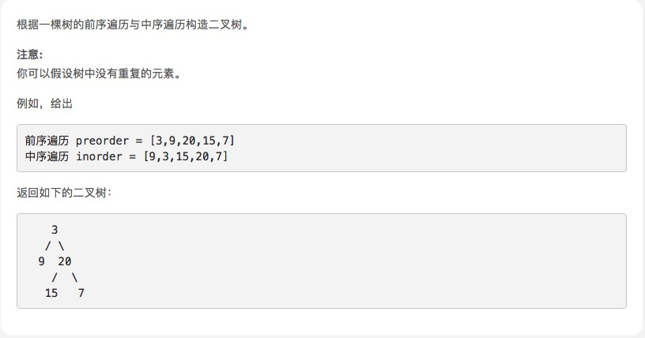

# [从前序与中序遍历序列构造二叉树](https://leetcode-cn.com/explore/interview/card/top-interview-questions-medium/32/trees-and-graphs/87/)



## 思路

中级的头有点疼了，[题解](https://leetcode-cn.com/problems/construct-binary-tree-from-preorder-and-inorder-traversal/solution/ding-wei-chu-gen-jie-dian-de-wei-zhi-hua-fen-zuo-y/)


```js
var buildTree = function (preorder, inorder) {
  if (inorder.length === 0) return null
  let root = new TreeNode(preorder[0]) 
  let mid = inorder.indexOf(preorder[0]) 
  root.left = buildTree(preorder.slice(1, mid + 1), inorder.slice(0, mid)) 
  root.right = buildTree(preorder.slice(mid + 1), inorder.slice(mid + 1))
  return root
};

```
* 字符串截取 slice 性能消耗比较大，没必要把 preorder 和 inorder 数组真的切割出来
* 用两个指针表示即可。写一个 helper 函数，接收2对指针

```js
var buildTree = (preorder, inorder) => {
  return helper(preorder, 0, preorder.length - 1, inorder, 0, inorder.length - 1)
}

function helper(preorder, p_start, p_end, inorder, i_start, i_end) {
  if (p_start > p_end) return null // preorder为空
  let rootVal = preorder[p_start] // 根节点的值
  let root = new TreeNode(rootVal) // 根节点
  let mid = inorder.indexOf(rootVal) // 根节点在inorder的位置
  let leftNum = mid - i_start // 左子树的节点数

  root.left = helper(preorder, p_start + 1, p_start + leftNum, inorder, i_start, mid - 1)
  root.right = helper(preorder, p_start + leftNum + 1, p_end, inorder, mid + 1, i_end)
  return root
}
```

* 每次递归都要在 inorder 数组中寻找根节点的位置，耗费性能
* 提前把 inorder 数组的项和索引存储在 HashMap 。查询哈希表比较节省性能

```js
var buildTree = (preorder, inorder) => {
  let map = new Map()
  for (let i = 0; i < inorder.length; i++) {
    map.set(inorder[i], i)
  }
  return helper(preorder, 0, preorder.length - 1, inorder, 0, inorder.length - 1, map)
}

function helper(preorder, p_start, p_end, inorder, i_start, i_end, map) {
  if (p_start > p_end) return null // preorder为空
  let rootVal = preorder[p_start] // 根节点的值
  let root = new TreeNode(rootVal) // 根节点
  let mid = map.get(rootVal) // 根节点在inorder的位置
  let leftNum = mid - i_start // 左子树的节点数

  root.left = helper(preorder, p_start + 1, p_start + leftNum, inorder, i_start, mid - 1, map)
  root.right = helper(preorder, p_start + leftNum + 1, p_end, inorder, mid + 1, i_end, map)
  return root
}

```

### 附加

另外一个巧妙的方法

* 变量 pre 保存当前要构造的树的 root
* 变量 in 保存 inorder 数组中可以成为 root 的数字们的开头那个
* 对于当前要构造的树，有一个停止点 stop ，inorder 数组中第 in 项到第 stop 项是要构造的树的节点值们
* 每次递归调用，都会确定出一个停止点，它告诉了子调用在哪里停止，把自己的根节点值作为左子树调用的停止点，自己的（父调用给下来的）停止点作为右子树的停止点


```js
var buildTree = function(preorder, inorder) {
    pre = i = 0
    build = function(stop) {
        if (inorder[i] != stop) {
            var root = new TreeNode(preorder[pre++])
            root.left = build(root.val)
            i++
            root.right = build(stop)
            return root
        }
        return null
    }
    return build()
};

```